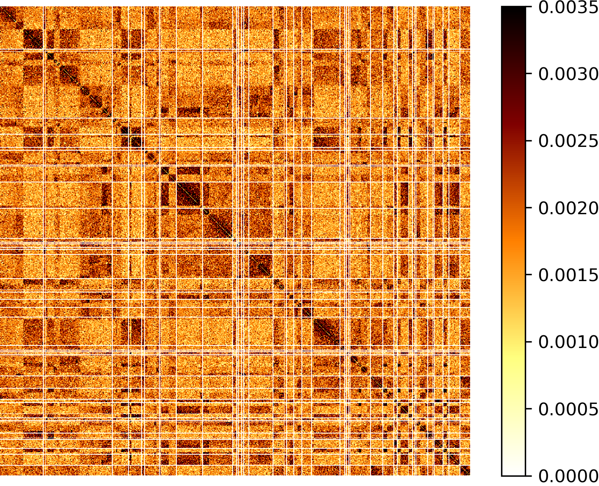
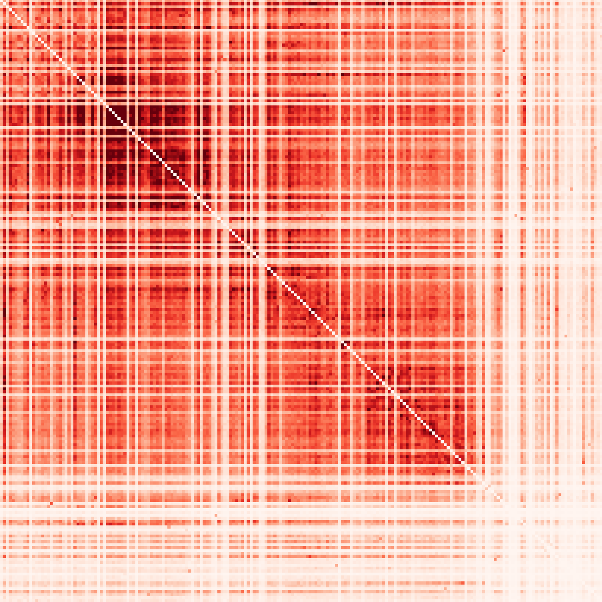

# MAG visualization and scaffolding

The goal of this tutorial is to show how to build the HiC contact map of a MAG from MetaTOR, visualize it an scaffold it.

## Table of contents

* [Requirements](#Requirements)
* [Input data](#Input-data)
* [A. Build the HiC contact map](#A-Build-the-HiC-contact-map)
* [B. Visualization of the contact map](#B-Visualization-of-the-contact-map)
* [C. Scaffolding of the contact map](#C-Scaffolding-of-the-contact-map)
* [References](#References)

## Requirements

* [MetaTOR](https://github.com/koszullab/metaTOR) [[1]](#References)
* [Pairix](https://github.com/4dn-dcic/pairix)
* [Instagraal](https://github.com/koszullab/instaGRAAL) [[2]](#References) if you want to try to scaffold your MAG. The installation could be tricky so we recommend to install it with docker which is a one step installation.

## Input data

As input data we will use the output of the [metaTOR (v1.1.2) tutorial](metator_tutorial.md) based on  the metaHiC sample from [Marbouty *et al.*, eLife, 2021](https://elifesciences.org/articles/60608). The accession number of the fastq sequences is SRR13435231 and the assembly accession number is ASM1314648v1 in the BioProject PRJNA627086 on the NCBI database. To have more contacts in the map we also use the MluCI library (SRR13435230) made on the same sample.

## A. Build the HiC contact map

MetaTOR have a conatct map module since the verison 1.1.0. This module allow to build the contact map of a contig or a bin using MetaTOR output files and [hicstuff](https://github.com/koszullab/metaTOR) [[3]](#References). The module extract the pairs of the metator object and build the contact map using hicstuff.

As an example we will display the MetaTOR_18_10 MAG which is a high quality MAG with a high HiC coverage:

|Name|lineage|completness|contamination|size|contigs|N50|longest_contig|GC|coding_density|taxonomy|HiC_Coverage|
|:-:|:-:|:-:|:-:|:-:|:-:|:-:|:-:|:-:|:-:|:-:|:-:|
|MetaTOR_18_10|o__Clostridiales|98.99|1.08|2971267|339|44097|160347|45.02|86.97|k__Bacteria;p__Firmicutes;c__Clostridia;o__Clostridiales;f__Ruminococcaceae|4.48E+03|
|MetaTOR_57_3|o__Bacteroidales|98.87|1.30|2638544|115|299658|490151|44.82|89.31|k__Bacteria;p__Bacteroidetes;c__Bacteroidia;o__Bacteroidales;f__Porphyromonadaceae_2|3.68E+03|

```sh
bin=MetaTOR_18_10
mkdir -p contact_map
metator contactmap -a ../assembly.fa -c contig_data_final.txt -e HpaII,MluCI -n $bin -p alignment_0.pairs,alignment_1.pairs -DfF -s 5000 -o contact_map/$bin/
```

```sh
INFO :: Generate HiC contact map for MetaTOR_18_10
INFO :: 5974370 pairs have been extracted.
INFO :: ## hicstuff: v3.0.1 log file
INFO :: ## date: 2021-06-29 11:34:27
INFO :: ## enzyme: HpaII,MluCI
INFO :: ## input1: ./tmp/6dd4adb2/MetaTOR_18_10.pairs 
INFO :: ## input2: None
INFO :: ## ref: contact_map/MetaTOR_18_10.fa
INFO :: ---
INFO :: Filtering with thresholds: uncuts=13 loops=9
INFO :: Proportion of inter contacts: 96.31% (intra: 115386, inter: 3008066)
INFO :: 2850918 pairs discarded: Loops: 34736, Uncuts: 2813077, Weirds: 3105
INFO :: 3123452 pairs kept (52.28%)
INFO :: 3% PCR duplicates have been filtered out (92787 / 3123452 pairs) 
INFO :: 3030665 pairs used to build a contact map of 17642 bins with 2886423 nonzero entries.
INFO :: Contact map generated after 0h 2m 56s
```

This will build the contact map and store it to the graal format which could be read by hicstuff view and instagraal. To have a matrix with a cool format as output, you need to specify the output format as below:

```sh
bin=MetaTOR_18_10
mkdir -p contact_map
metator contactmap -a ../assembly.fa -c contig_data_final.txt -e HpaII -n $bin -p alignment_0.pairs,alignment_1.pairs -DfF -s 5000 -o contact_map/$bin/ -m cool
```

**Note**: Here we show to give an example using a Final bin, but you could put others "metaTOR object": contigs, core bins, overlpping bin, recursive bin or others. For the contigs it's possible to give both the id or the name. For the "other" object, you need to add a column in the contig data file call "Others" with whatever clustering you want. It could be another such as anvio binning (see tutorial [here](manual_curation_of_metator_MAGs.md)).

### Using pairix index

If you want to viusalize multiple objects, in order to avoid to iterate each time on the pairs file it's possible to build an index of the pairs file using pairix. For now, MetaTOR do not provide any script which directly build the index and you have to build it by hand. Here it's an example of command to build the pairs indexed and launch MetaTOR contactm map on it.

```sh
# Sort the pairs file
grep "^#" alignment_0.pairs > alignment_0_sorted.pairs
grep -v "^#" alignment_0.pairs | sort --parallel 16 -S 2GB -k2,2V -k4,4V -k3,3n -k5,5n >> alignment_0_sorted.pairs
# Compress the pairs file
bgzip alignment_0_sorted.pairs
# Build the index
pairix alignment_0_sorted.pairs.gz
# Launch MetaTOR contact map
metator contactmap -a ../assembly.fa -c contig_data_final.txt -e HpaII,MluCI -n $bin -p alignment_0_sorted.pairs.gz -DfF -s 5000 -o contact_map/$bin/
```

## B. Visualization of the contact map

Once we have build the map with `metator contactmap` module, we could visualize the matrix using either [hicstuff](https://github.com/koszullab/hicstuff).

If you have install using pip, hicstuff should already be installed. So you can directly use hicstuff view to viusalize the matrix.

```sh
hicstuff view -f contact_map/$bin/fragments_list.txt -n -b 5kb -c afmhot_r -o contact_map/$bin/original_contact_map.png contact_map/$bin/abs_fragments_contacts_weighted.txt
```



## C. Scaffolding of the contact map

If we have high quality 3D signal with an HiC coverage around 1000 it's possible to try to scaffold the MAG using instagraal. If you have use graal format you can directly launch instagraal on the output file. For the acaffolding, it's important to first remove contigs smaller than 5kb (`--size 5000` in `metator contactmap`) as instagraal does not handle them well.

```sh
cd contact_map/$bin/
instagraal ./ $bin.fa  ./ --save-matrix -n 50
```

The save matrix parameter will give intermediate steps matrix from insatgraal during the convergence and you will see something like that:

|Iteration 1:|Iteration 10:|Iteration 50:|
|:-:|:-:|:-:|
||||

After instagraal has run, a plosihing step of the genome is necessary to retrieve assembly contigs which might be split by instagraal.

```sh
instagraal-polish -m polishing -i test_mcmc_4/info_frags.txt -f $bin.fa  -o "$bin"_scaffold.fa
cd ../.. 
```

Then you can build again the contact map using hicstuff to visualize it:

```sh
cd ..
hicstuff pipeline -g metator_folder/contact_map/$bin/"$bin"_scaffold.fa  -e HpaII,MluCI -DFf -o metator_folder/contact_map/$bin/hicstuff_scaffold -t 16 hic_1_for.fastq.gz,hic_2_for.fastq.gz hic_1_rev.fastq.gz,hic_2_rev.fastq.gz
cd metator_folder/contact_map/$bin/
hicstuff view -f hicstuff_scaffold/fragments_list.txt -n -b 5kb -c afmhot_r -o scaffolded_contact_map.png hicstuff_scaffold/abs_fragments_contacts_weighted.txt
cd ../../
```

|MAG|Original Contact map|Scaffolded contact map|
|:-:|:-:|:-:|
|MetaTOR_18_10|||
|MetaTOR_57_3|||

As you can see the output scaffolding matrix is not perfect and there are still some translocation. Here is two examples of scaffolding output.

For the MetaTOR_57_3, instagraal manage to build a nice scaffold with a nice circular signal. However there are still some small contigs which are noot integrate in the scaffold. This is an issue as instagraal have some diffculties to scaffold small contigs. That's why we advise to not integrate contigs smaller than 5kb. They just add some noise without improving the scaffolding. If you want a more perfect genome, it's possible using the contact map matrix to reintegrates this contigs by hand.

The second example, MetaTOR_18_10, presents a recurrent issue of instagraal. Indeed, bacterial chromosome have often a "secondary diagonal". This signal will perturbate proximity ligation signal model of instagraal causing a lot of translocation along the diagonal that we called "stair syndrome". As in the previous step, a manual step allows to reconstruct the genome without all this translocation.

To conclude, instagraal can build nice scaffolds of the high quality MAGs with high HiC coverage and the majority contigs bigger than 5kb from the metaTOR binning. However, to build a more perfect scaffold a final manual step is still necessary.

## References

* [1] [MetaTOR: A Computational Pipeline to Recover High-Quality Metagenomic Bins From Mammalian Gut Proximity-Ligation (meta3C) Libraries.](https://www.frontiersin.org/articles/10.3389/fgene.2019.00753/full), L. Baudry, T. Foutel-Rodier, A. Thierry, R. Koszul, M. Marbouty. *Frontiers in genetics*, 2019.
* [2] [instaGRAAL: chromosome-level quality scaffolding of genomes using a proximity ligation-based scaffolder](https://genomebiology.biomedcentral.com/articles/10.1186/s13059-020-02041-z), L. Baudry, N. Guiglielmoni, H. Marie-Nelly, A. Cormier, M. Marbouty, K. Avia, Y. Loe Mie, O. Godfroy, L. Sterck, J. M. Cock, C. Zimmer, S. M. Coelho, R. Koszul, *Genome Biology*, 2020.
* [3] [Hicstuff: Simple library/pipeline to generate and handle Hi-C data.](http://doi.org/10.5281/zenodo.2620608), C. Matthey-Doret, L. Baudry, A. Bignaud, A. Cournac, R. Montagne, N. Guiglielmoni, T. Foutel Rodier and V. F. Scolari, *Zenodo*, 2020.
